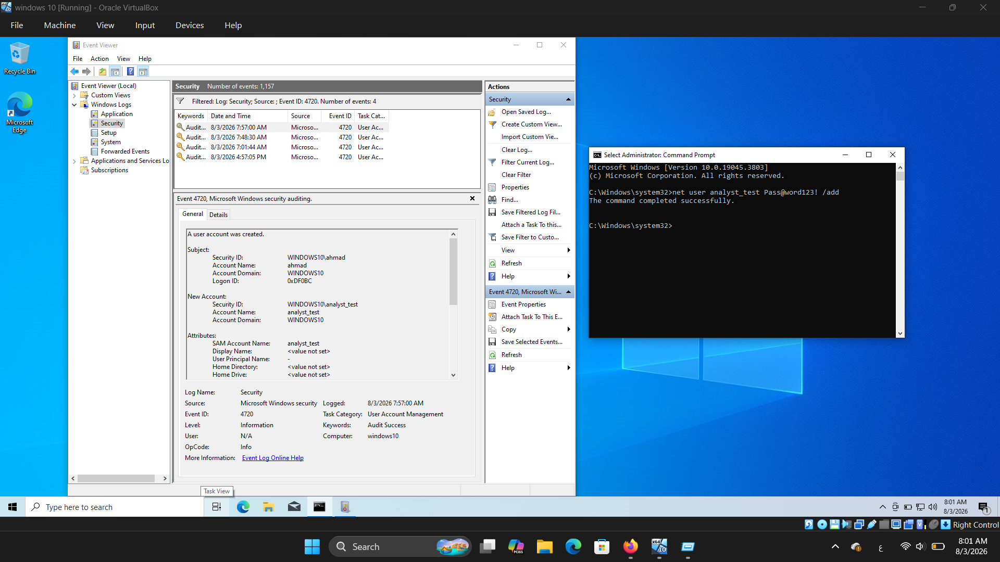
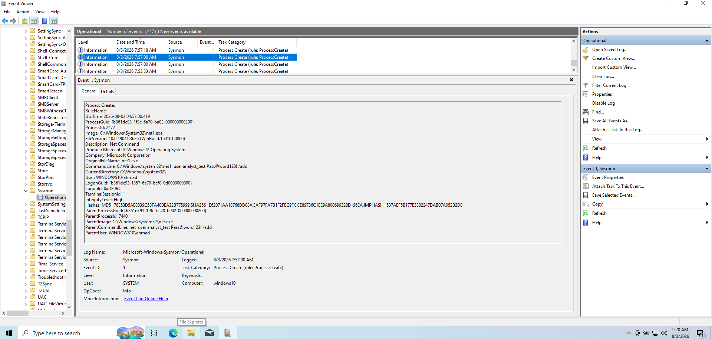
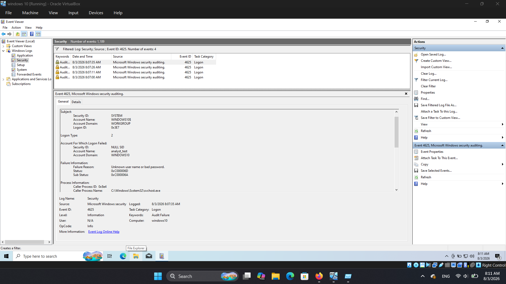
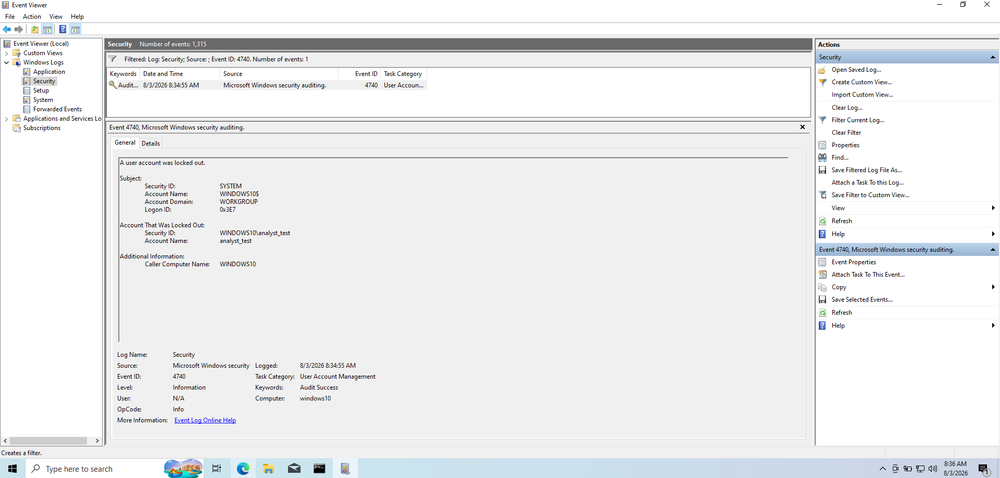
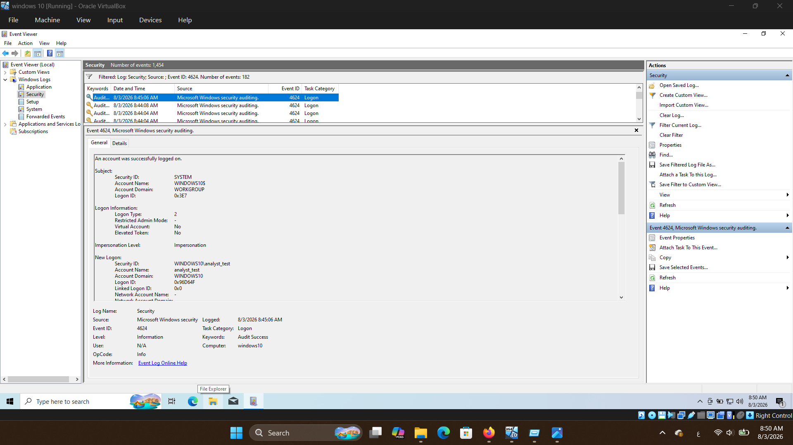

# Windows Event Log & Sysmon Monitoring Lab

## Objective
Learn how SOC analysts investigate Windows security event logs and track potential authentication threats and process executions using native Windows tools and Sysmon.

---

## Tools Used
* **Windows 10 Virtual Machine**
* **Windows Event Viewer (`eventvwr.msc`)**
* **System Monitor (Sysmon v15.21)**

---

## Lab Setup & Security Policies
* Configured Account Lockout Threshold to **3 failed attempts** using `net accounts /lockoutthreshold:3`.
* Verified Subcategory Audit Policies for **Account Lockout** and **User Account Management** via `auditpol`.

---

## Investigation Tasks & Screenshots

### Task 1: New User Creation
* **Security Event ID**: `4720`
* **Sysmon Event ID**: `1` (Process Creation)
* **Analysis**: Detected administrative user creation for `analyst_test`. Sysmon captured the exact process execution lineage showing `cmd.exe` executing `net1.exe` with the full command-line arguments.

---

### Task 2: Failed Login Attempts
* **Security Event ID**: `4625`
* **Sub-Status Code**: `0xC000006A` (Bad Password)
* **Logon Type**: `2` (Interactive)
* **Analysis**: Captured failed logon attempts against the newly created account `analyst_test` from the local interactive console.

---

### Task 3: Account Lockout
* **Security Event ID**: `4740`
* **Analysis**: Account `analyst_test` was automatically locked out after exceeding the 3-failed-attempt security policy threshold.

---

### Task 4: Successful Interactive Logon
* **Security Event ID**: `4624`
* **Logon Type**: `2` (Interactive Console)
* **Analysis**: Verified successful authentication for `WINDOWS10\analyst_test` after administrative account unlock (`net user analyst_test /active:yes`).

---

## Key Takeaways
1. **Identity vs. Telemetry**: Windows Security Logs specify **WHO** performed the authentication action, while Sysmon provides **HOW** the command was executed (parent-child process relationship and full command lines).
2. **Correlation**: Cross-referencing Event `4720` with Sysmon Event `1` allows analysts to trace user management activity back to specific shell executions.

---

## Resume Point
> Analyzed Windows Security Event Logs and investigated authentication-related events (IDs 4720, 4625, 4740, 4624) and command-line execution lineage using Event Viewer and Sysmon.
